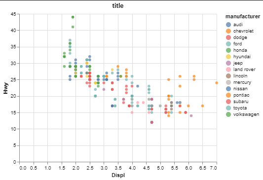

# Client Report - [Introduction]
__Course CSE 250__
__Alex Berryhill__

## Elevator pitch

So this time we learned how to get altair working, that was not fun. I struggled with nodeJS for 3 hours itself. We have a dataset and want to find the connection from a car's engine size (displ) and a cars fuel efficency in mpg(hwy). Hopefully I did this right.

### GRAND QUESTION 1
#### Finish the readings and come to class prepared with any questions to get your environment working smoothly.
It is working and running smoothly now.

##### TECHNICAL DETAILS

```python 
import altair as alt
import pandas as pd

data = pd.read_csv("data.csv")
print(data.head(2))
```

### GRAND QUESTION 2
#### Create a python script and use VS Code to create the example Altair chart in the assigned readings (note that you have to type chart to see the Altair chart after you run the code). Save your Altair chart for submission.
The more Litres in the engine size, the lower the fuel efficency.

##### TECHNICAL DETAILS

```python 
chart = alt.Chart(data, title="title").mark_circle().encode(
    alt.X("displ", title="Displ"),
    alt.Y("hwy", title="Hwy"),
    alt.Color("manufacturer")
).properties(width=400, height=300)

chart
```

_insert your chart png here_


### GRAND QUESTION 3
#### Include the Markdown table created from the following code in your report (assuming you have mpg from question 2).
It is pretty cool how much data there is, I love using head() to get a little bit of the data.

##### TECHNICAL DETAILS

```python 
print(mpg
    .head(5)
    .filter(["manufacturer", "model","year", "hwy"])
    .to_markdown(index=False))
```
The table
| manufacturer   | model   |   year |   hwy |
|:---------------|:--------|-------:|------:|
| audi           | a4      |   1999 |    29 |
| audi           | a4      |   1999 |    29 |
| audi           | a4      |   2008 |    31 |
| audi           | a4      |   2008 |    30 |
| audi           | a4      |   1999 |    26 |
